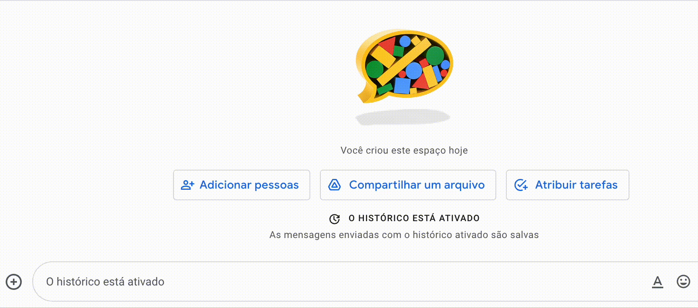

# Automatically append emoji descriptions to your Google Chat messages

- Currently only tested in the [Google Chat](https://mail.google.com/chat/) interface (both webpage and web standalone app);
- After picking an emoji, type an additional space to append the description;

## Instalation

Since the extension is not available in the Chrome Web Store, please follow [these instructions](https://developer.chrome.com/docs/extensions/mv2/getstarted/#:~:text=The%20directory%20holding%20the%20manifest%20file%20can%20be%20added%20as%20an%20extension%20in%20developer%20mode%20in%20its%20current%20state.) to install it using development mode.

